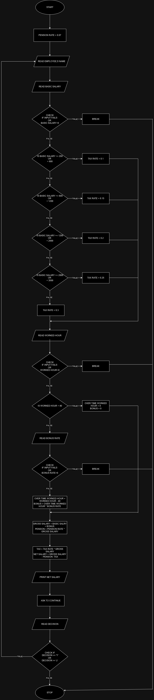

### Problem Analysis

**Input**

- Employee name
- Basic salary
- Worked Hour
- Bonus rate
- pension rate

**Output**

- Net salary

**Operation**
- determine tax rate 

            - if basic salary < 200: tax rate = 0
            - else if basic salary >= 200 and <600: tax rate = 10%
            - else if basic salary >= 600 and <1200: tax rate = 15%
            - else if basic salary >= 1200 and <2000: tax rate = 20%
            - else if basic salary >= 2000 and <3500: tax rate = 25%
            - else : tax rate = 30%
- Net salary = gross salary - tax - pension
        
        - Bonus = extra worked hour * bonus rate
        - Gross salary = basic salary + bonus
        - Pension = gross salary * pension rate
        - tax = gross salary * tax rate

### Pseudo Code

Step 1: Start

Step 2: Declare variables

Step 3: Initialize pension rate `pension rate = 0.07`

Step 4: Begin main loop (`do while loop`) `Repeat the following steps until the user decide to stop`

```
   Step 4.1: Read employee's name

   Step 4.2: Read basic salary

        Step 4.2.1: if input fails or basic salary < 0
                     clear input
                     ignore input
                     break out of loop

   Step 4.3: Determine tax rate

       Step 4.3.1: If basicSalary < 200
                            taxRate = 0
       Step 4.3.2: Else if basicSalary >= 200 and < 600
                            taxRate = 0.1
       Step 4.3.3: Else if basicSalary >= 600 and < 1200 
                            taxRate = 0.15
       Step 4.3.4: Else if basicSalary >= 1200 and < 2000 
                            taxRate = 0.2
       Step 4.3.5: Else if basicSalary >= 2000 and < 3000
                            taxRate = 0.25
       Step 4.3.6: Else 
                            taxRate = 0.3
    Step 4.4: Read Worked Hour

        Step 4.2.1: if input fails or worked hour < 0
                     clear input
                     ignore input
                     break out of loop

    Step 4.5: Calculate bonus

        Step 4.5.1: If workedHour < 40:
                         overTimeWorkedHour = 0
                         bonus = 0
        Step 4.5.2: Else:

                 Step 4.5.2.1: Read bonus rate 

                 Step 4.5.2.2: if input fails or bonus rate < 0
                             clear input
                             ignore input
                             break out of loop
                 Step 4.5.2.3: 
                            over time worked hour = worked hour - 40
                            bonus = over time worked hour * bonus rate

    Step 4.6: Calculate Net salary
                
                gross salary = basic salary + bonus
                pension = pension rate * gross salary
                tax = tax rate * gross salary
                net salary = gross slary - tax - pension
    
    Step 4.7: Print net salary

    Step 4.8:  Ask to continue
               
        Step 4.8.1: Read Decision
              Step 4.8.1.1: If decision == 'Y' or decision == 'y'
                                   go to step 4
              Step 4.8.1.2: else
                                   go to step 5

```

Step 5: Stop

### Flow chart


