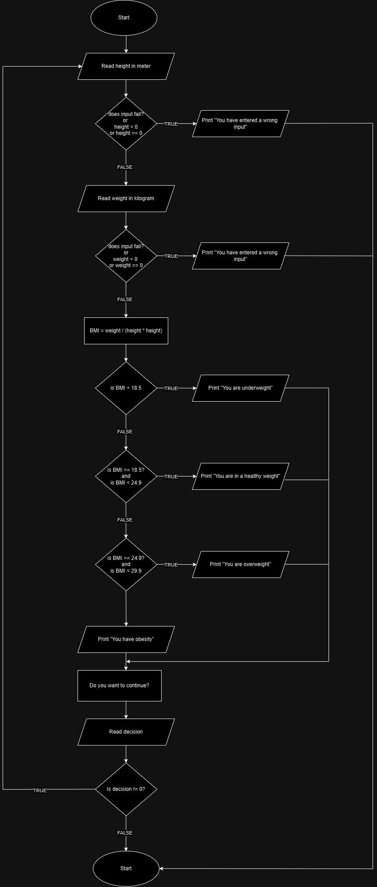

###### Problem: Make a program that calculates the Body Mass Index (BMI) of a person and determine weather the person is in normal weight, under weight or over weight. BMI is calculated as (BMI = w/h*h). Make the program to work for multiple person before terminated.

#### Problem Analysis

**Input**
  -Height
  -Weight
**Output**
   -BMI
**Operation**
  -Itrate to work for multiple persons
  -BMI = Weight / (Height * Height)

  #### Pseudo code

  Step 1: Start
  Step 2: Read height in meter
  ```
  Step 2.1: check if input fails or height < 0
    Step 2.1.1: if true
              print "You have entered a wrong input"
    Step 2.2.2: else
              go to step 3
  ```
  Step 3: Read weight in kilogram

  ```
  Step 3.1: check if input fails or weight < 0
    Step 3.1.1: if true
                 print "You have entered a wrong input"
    Step 3.2.2: else
                go to step 4
  ```
  Step 4: Calculate BMI
  ```
            BMI = Weight / (Height * Height)
  ```
  Step 5: Check if BMI < 18.5
  ```
    Step 5.1: if true
              print "You are underweight."
    Step 5.2: else 
              go to step 6
  ``` 
  Step 6: Check if BMI >= 18.5 and BMI < 24.9
  ```
    Step 6.1: if true
              print "You are in a healthy weight."
    Step 6.2: else 
              go to step 7
  ``` 
Step 7: Check if BMI >= 24.9 and BMI < 29.9
  ```
    Step 7.1: if true
              print "You are overweight."
    Step 7.2: else 
              print "You have obesity"
  ``` 

Step 8: Check if the user wants to continue
```
   Step 8.1: Read decision 
```
Step 9: Check if decision != 0
```
   Step 9.1: if true
              go to step 2
   Step 9.2: else
              go to step 10 
```
Step 10: Stop

### Flow Chart



