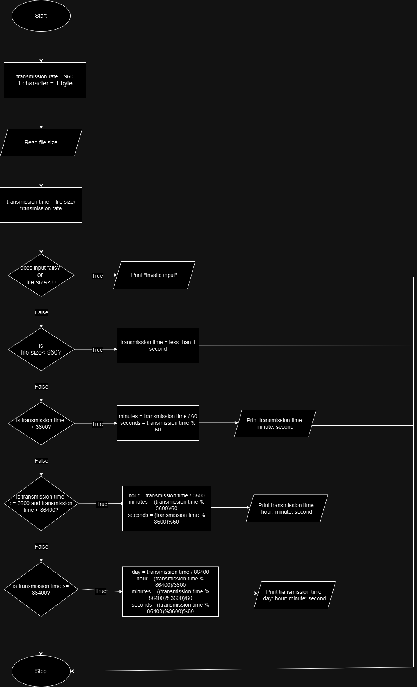

###### Problem: A serial transmission line can transmit 960 characters a second. Write a program that will calculate how long it will take to send a file, given the file size. Test your program on a 400MB (419,430,400 byte) file which may take days.

### Problem Analysis

**Input**
- transmission rate
- file size

**Output**
- transmission time
- express the transmission time using divisions of time(days, hours, minutes, seconds) 

**operation**
- transmission time = file size / transmission rate 

### Pseudo Code

Step 1: Start
Step 2: Initialize 
```
                 transmission rate = 960 characters per second
                 1 character = 1 byte
```
Step 3: Read file size
Step 4: Calculate transmission time 
```
                      transmission time = file size / transmission rate
```
Step 5: Check if input fails
```
      Step 5.1: If true
                      Print "Invalid input"
      Step 5.2: else
                      go to step 6
```
Step 6: Check if file size <= 960
```
      Step 6.1: if true
                      transmission time = <1 second
      Step 6.2: else
                    go to step 7   
```
Step 7: check if transmission time < 3600
```
      Step 7.1: if true
                    minutes = transmission time / 60
                    seconds = transmission time % 60
         Step 7.1.1 Print transmission time interms of minute and second(minute: second)
      Step 7.2: else 
                   go to step 8
```

Step 8: check if transmission time <= 3600 and transmission time < 86400
```
    Step 8.1: if true
                    hours = transmission time / 3600
                    minutes = (transmission time % 3600)/60
                    seconds = (transmission time % 3600)%60
         Step 8.1.1 Print transmission time interms of hour, minute and second(hour: minute: second)
    Step 8.2: else
                go to step 9
```

Step 9: check if transmission time >= 86400
```
     Step 9.1: if true
                    days = transmission time / 86400
                    hours = (transmission time % 86400)/ 3600
                    minutes = ((transmission time % 86400)% 3600)/60
                    seconds = ((transmission time % 86400)% 3600)%60
         Step 9.1.1 Print transmission time interms of day, hour, minute and second(day: hour: minute: second)
     Step 9.2: else 
                   go to step 10
```
Step 10: Stop

### Flow Chart


