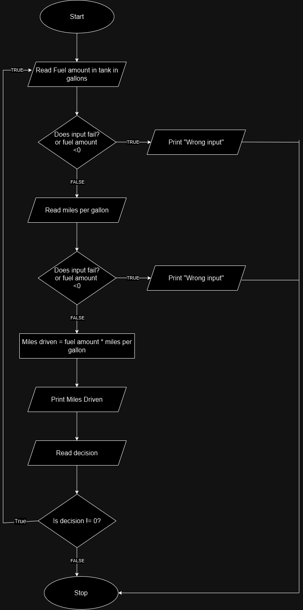

### Problem Analysis
**Input**
-Fuel amount in fuel tank in gallon
-Miles driven per gallon

**Output**
-Total miles driven with out refueling

**Operation**
-Total miles = Fuel amount in fuel tank * miles driven per gallon

### Pseudo Code

Step 1: Start
Step 2: Read Fuel amount in gallon
Step 3: check if input fail 
```
     Step 3.1: if true
                    print "Wrong input"
                    go to step 
    Step 3.2: else
                   go to step 4 
```
Step 4: Read miles driven per gallon
Step 5: Check if input fails
```
    Step 5.1: if true
                    print "Wrong input"
    Step 5.2: else 
                    go to step 6 
```
Step 6: Calculate total miles driven
```
                    miles driven = fuel amount * miles driven per gallon
```

Step 7: Print total miles driven
Step 8: Stop

### Flow Chart

