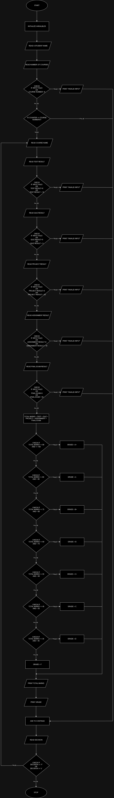

### Problem Analysis

**Input**

- Student's name
- Number of courses
- Scores for tests, quizzes, projects, assignments, and final exams

**Output**

- Total Marks
- Assigned grade

**Operation**

- Total marks = test + quiz + project + assignment + final exam
- Assign a letter grade based on total marks.

   - If totalMarks >= 90, set grade = "A+".
   - Else if totalMarks >= 80, set grade = "A".
   - Else if totalMarks >= 75, set grade = "B+".
   - Else if totalMarks >= 60, set grade = "B".
   - Else if totalMarks >= 55, set grade = "C+".
   - Else if totalMarks >= 45, set grade = "C".
   - Else if totalMarks >= 30, set grade = "D".
   - Else set grade = "F".

### Pseudo code

Step 1: Start

Step 2: Initialize Variables

Step 3: Begin Main Loop(`do-while loop`) `repeat the following steps until the user decides to stop`

Step 4: Read a student name

Step 5: Read number of courses

```
    Step 5.1: if input fails or number of courses < 0
                   print "Invalid input"


    Step 5.2: Begin course loop(`for loop`) `For each course from 1 to course numbers, do the following`

       Step 5.2.1 : Read course name

       Step 5.2.2: Read test result

            Step 5.2.2.1: if input fails or test result < 0 or test result > 15
                    print "Input fail"       


       Step 5.2.3: Read quiz result

            Step 5.2.3.1: if input fails or quiz result < 0 or quiz result > 5
                    print "Input fail"       


       Step 5.2.4: Read project result

            Step 5.2.4.1: if input fails or project result < 0 or test result > 20
                    print "Input fail"       

        Step 5.2.5: Read assignment result

            Step 5.2.5.1: if input fails or assignment result < 0 or assignment result > 20
                    print "Input fail"       

        Step 5.2.6: Read final exam result

            Step 5.2.6.1: if input fails or final exam result < 0 or final result > 50
                    print "Input fail"   
       Step 5.2.7: Calculate total marks

                   total marks = test + quiz + project + assignment + final exam
       Step 5.2.8: Determine grade

           Step 5.2.8.1: If totalMarks >= 90 and <= 100
                     grade = "A+"
           Step 5.2.8.1: Else if totalMarks >= 80 and < 90
                     grade = "A"
           Step 5.2.8.1: Else if totalMarks >= 75 and < 80
                     grade = "B+"
           Step 5.2.8.1: Else if totalMarks >= 60 and < 75
                     grade = "B"
           Step 5.2.8.1: Else if totalMarks >= 55 and < 60
                     grade = "C+"
           Step 5.2.8.1: Else if totalMarks >= 45 and < 55 
                     grade = "C"
           Step 5.2.8.1: Else if totalMarks >= 30 and < 45  
                     grade = "D"
           Step 5.2.8.1: Else  
                     grade = "F"

       Step 5.2.9: print 
                     - total marks
                     - grade
    
    Step 5.3: Ask to continue
    Step 5.4: Read decision 
        
        Step 5.4.1: If decision == 'Y' or decision == 'y'
                       go to step 3
        Step 5.4.2: else
                       go to step 6
```

Step 6: Stop

### Flow chart



