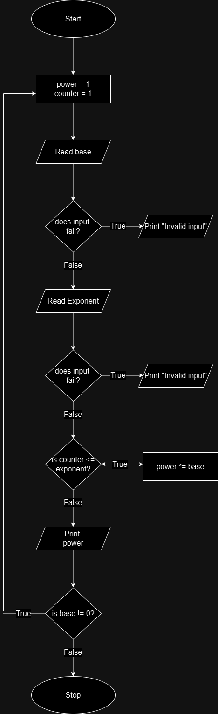

###### problem:Write a program that find the result of the expression 𝑥^𝑦 where the value of X and Y are entered by the user.

### Problem Analysis
**Input**
-base
-exponent
**Output**
-Power
**Operation**
power = base ^ exponent

### Pseudo Code

Step 1: Start
Step 2: Initialize
```
                  power = 1
                  counter = 1
```
Step 3: Read the base of the  number
Step 4: Check if input fails 
```
      Step 4.1: if true
                      print "Invalid input"
      Step 4.2: else
                      go to step 5
```
Step 5: Read the exponent of the number
Step 6: Check if input fails
```
      Step 6.1: if true 
                      print "Invalid input"
      Step 6.2: else
                      go to step 7
                     
```
Step 7: check if counter <= exponent
```
      Step 7.1: if true 
                      power *= base
                      go to step 7
      Step 7.2: else
                      go to step 8
```

Step 8: print power
Step 9: Check if base != 0
```
     Step 9.1: if true
                     go to step 2
     Step 9.2: else
                     go to step 10
```
Step 10: Stop

### Flow Chart


