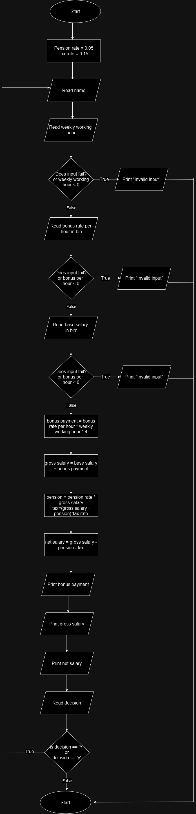

###### problem:Design an algorithm and write a to read an employee name weekly working hours, bonus rate per hour and base salary and find the employees gross-salary, net salary and bonus payment. (Hint: pension rate – 5%, tax: 15%).

#### Problem Analysis
**Input**
- name
- weekly working hour
- bonus rate per hour in birr
- base salary in birr
- pension rate
- tax rate


**Output**

- bonus payment
- gross salary
- net salary

**Operation**
bonus payment = weekly working hour * 4 * bonus rate per hour
gross salary = base salary + bonus payment
pension = (gross salary) * pension rate
tax = (gross salary - pension) * tax rate
net salary = gross salary - pension - tax

#### PseudoCode

Step 1: Start
Step 2: initialize
```
                  pension rate = 0.05
                  tax rate = 0.15
```

step 3:Read name
Step 4:Read weekly working hour
Step 5: check if input fails or weekly working hour < 0
```
     Step 5.1: if true
                     Print "Invalid input"
    Step 5.2: else
                     go to step 6
```
Step 6:Read bonus rate per hour in birr
Step 7: check if input fails or bonus rate per hour < 0
```
     Step 7.1: if true
                     Print "Invalid input"
    Step 7.2: else
                     go to step 8
```
Step 8:Read base salary 
Step 9: check if input fails or base salary < 0
```
     Step 9.1: if true
                     Print "Invalid input"
    Step 9.2: else
                     go to step 10
```

Step 10: calculate bonus payment
```
// multiply weekly working hour by 4 because there are 4 week in a month

                     bonus payment = bonus rate per hour * 4 * weekly working hour
```
Step 11: Calculate gross salary
```
                      gross salary = base salary + bonus payment
```

Step 12: Calculate total deduction
```
                    pension = gross salary * pension rate
                    tax = (gross salary - pension) * tax rate
                    total deduction = pension + tax
``` 

Step 13: Calculate net salary
```
                   net salary = gross salary - total deduction
```

Step 14: print bonus payment
Step 15: Print gross salary
Step 16: Print net salary
Step 17:Prompt user if s/he wants to continue
step 18: Read decision
Step 19: Check if decision == 'Y' or decision == 'y'
```
       Step 19.1: if true
                         go to step 2
       Step 19.2: else
                         go to step 20
```
Step 20: Stop

### Flow Chart



