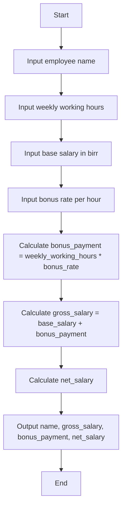

```mermaid
graph TD
    A[Start] --> B[Input employee name]
    B --> C[Input weekly working hours]
    C --> D[Input base salary in birr]
    D --> E[Input bonus rate per hour]
    E --> F[Calculate bonus_payment = weekly_working_hours * bonus_rate]
    F --> G[Calculate gross_salary = base_salary + bonus_payment]
    G --> H[Calculate net_salary]
    H --> I[Output name, gross_salary, bonus_payment, net_salary]
    I --> J[End]
```
