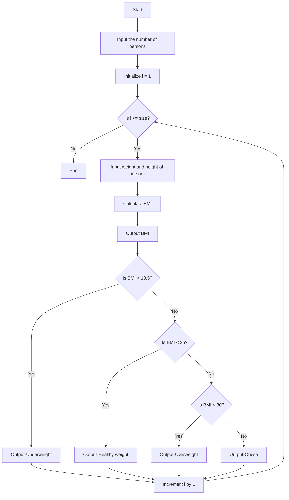

```mermaid 
graph TD
    A[Start] --> B[Input the number of persons]
    B --> C[Initialize i = 1]
    C --> D{Is i <= size?}
    D -->|No| E[End]
    D -->|Yes| F[Input weight and height of person i]
    F --> G[Calculate BMI]
    G --> H[Output BMI]
    H --> I{Is BMI < 18.5?}
    I -->|Yes| J[Output-Underweight]
    I -->|No| K{Is BMI < 25?}
    K -->|Yes| L[Output-Healthy weight]
    K -->|No| M{Is BMI < 30?}
    M -->|Yes| N[Output-Overweight]
    M -->|No| O[Output-Obese]
    J --> P[Increment i by 1]
    L --> P
    N --> P
    O --> P
    P --> D
```
