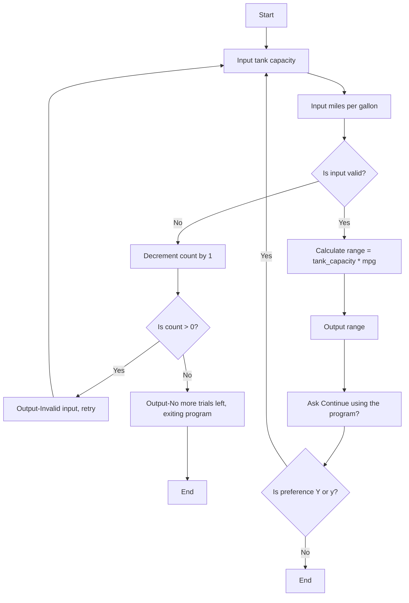

```mermaid
graph TD
    A[Start] --> B[Input tank capacity]
    B --> C[Input miles per gallon]
    C --> D{Is input valid?}
    D -->|No| E[Decrement count by 1]
    E --> F{Is count > 0?}
    F -->|Yes| G[Output-Invalid input, retry]
    G --> B
    F -->|No| H[Output-No more trials left, exiting program]
    H --> I[End]
    D -->|Yes| J[Calculate range = tank_capacity * mpg]
    J --> K[Output range]
    K --> L[Ask Continue using the program?]
    L --> M{Is preference Y or y?}
    M -->|Yes| B
    M -->|No| N[End]

```
