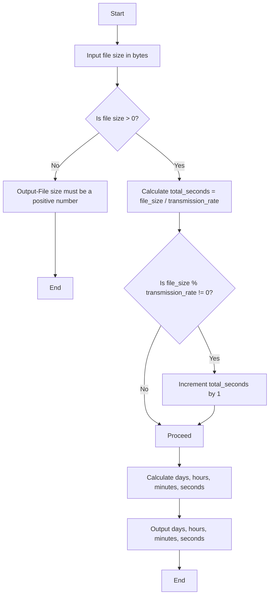

```mermaid
graph TD
    A[Start] --> B[Input file size in bytes]
    B --> C{Is file size > 0?}
    C -->|No| D[Output-File size must be a positive number]
    D --> E[End]
    C -->|Yes| F[Calculate total_seconds = file_size / transmission_rate]
    F --> G{Is file_size % transmission_rate != 0?}
    G -->|Yes| H[Increment total_seconds by 1]
    G -->|No| I[Proceed]
    H --> I
    I --> J[Calculate days, hours, minutes, seconds]
    J --> K[Output days, hours, minutes, seconds]
    K --> L[End]


```
