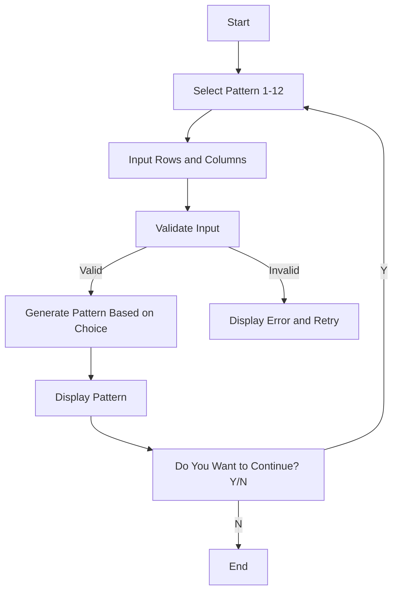

## Problem Analysis

### Problem Description
The program allows the user to choose from a variety of patterns and prints the selected pattern based on the number of rows and columns specified by the user. The patterns include various shapes and arrangements of numbers, alphabets, and stars.

### Inputs
* Pattern choice: An integer (1-12) corresponding to a specific pattern to display.
* Number of rows: An integer specifying the number of rows for the pattern.
* Number of columns: An integer specifying the number of columns for the pattern.

### Outputs
* The selected pattern displayed on the screen, based on the input choice, rows, and columns.

### Processing Steps
1. **Input:** Prompt the user to select a pattern number (1-12) and input the desired number of rows and columns.
2. **Validation:** Validate the pattern choice and the number of rows and columns to ensure they are within valid ranges.
3. **Pattern Selection and Display:**
   * Based on the selected pattern number, use nested loops to iterate over the specified number of rows and columns.
   * For each pattern, implement specific logic to print the desired characters (numbers, alphabets, or stars) at the appropriate positions.
   * Some patterns may require additional calculations or conditional checks to determine the character to be printed.
4. **Error Handling:** If the user enters an invalid pattern choice, display an error message.

### Pattern Choices
1. **Numbers in a grid:** Displays numbers from 1 to `cols` for `rows` times.
2. **Alphabet pattern:** Displays alphabets in a grid, filling from A to Z.
3. **Right-angled triangle of numbers:** Displays numbers in an increasing fashion, row by row.
4. **Pyramid of numbers:** A number pyramid with increasing numbers.
5. **Right-angled triangle of alphabets:** Displays alphabets in a triangle form.
6. **Full grid of lowercase letters:** Displays a grid of lowercase letters (a to z).
7. **Hollow square of stars:** Displays a hollow square of stars.
8. **Inverted triangle of stars:** Displays a decreasing number of stars in each row.
9. **Full pyramid of stars:** Displays a full pyramid of stars.
10. **Inverted pyramid of stars:** Displays an inverted pyramid of stars.
11. **Hollow diagonal square:** Displays a square with a hollow center and diagonal stars.
12. **Hollow diamond pattern:** Displays a hollow diamond shape with stars.

