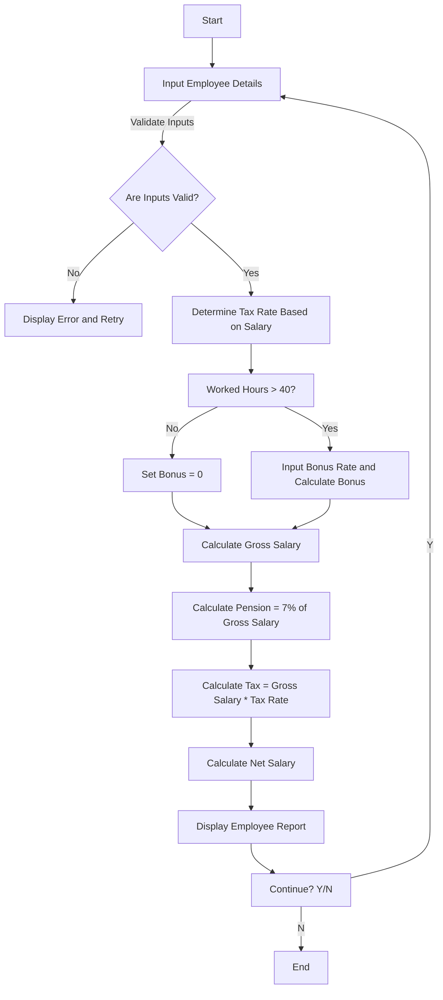

## Problem Analysis

### Problem Description
The program calculates the net salary of an employee based on their basic salary, worked hours, bonus rate, and applicable deductions (tax and pension). It iteratively processes multiple employees' salary calculations until the user decides to stop.

### Inputs
* Employee's name (string)
* Basic salary (float)
* Worked hours (float)
* Bonus rate per hour (float, if overtime exists)
* Decision to continue (char: 'Y' or 'N')

### Outputs
* Employee's name
* Basic salary
* Worked hours and overtime hours
* Bonus payment
* Gross salary
* Pension deduction (7% of gross salary)
* Tax deduction (based on tax brackets)
* Net salary (Gross salary - Pension - Tax)

### Processing Steps
1. **Input:** Prompt the user to input the employee's details.
2. **Validation:** Validate the input values (basic salary, worked hours, bonus rate) to ensure they are within valid ranges.
3. **Tax Calculation:** Determine the applicable tax rate based on the basic salary using predefined tax brackets.
4. **Bonus Calculation:** Calculate the bonus for overtime hours if the worked hours exceed a specified threshold (e.g., 40 hours).
5. **Salary Calculation:**
   * **Gross Salary:** Calculate the gross salary by adding the basic salary and bonus.
   * **Pension Deduction:** Calculate the pension deduction as 7% of the gross salary.
   * **Tax Deduction:** Calculate the tax deduction by multiplying the gross salary by the applicable tax rate.
   * **Net Salary:** Calculate the net salary by subtracting the pension and tax deductions from the gross salary.
6. **Output:** Display a summarized report of the calculated values.
7. **Loop:** Ask the user if they want to calculate the salary for another employee. If yes, repeat from step 1. Otherwise, terminate the program.

