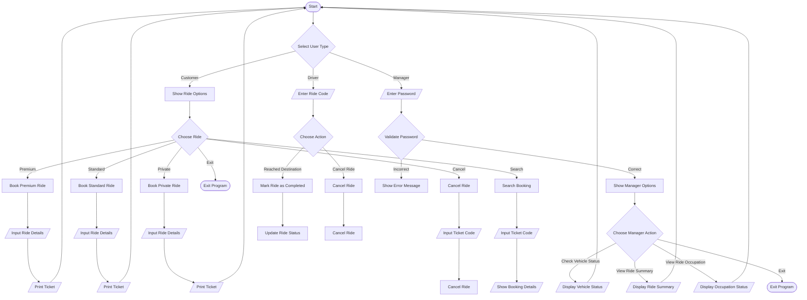

### Problem Analysis

#### Input

* User Type Selection:
`A for Customer`
`B for Driver`
`C for Manager`

**Customer Inputs:**

1. Ride preference (`Premium, Standard, Private, Cancel Ride, Search Booking`)
2. Personal details (`Name, Pickup Location, Destination`)
3. `Ticket code` for searching or canceling bookings

**Driver Inputs:**

1. `Ride code` to mark a ride as completed or to cancel it.

**Manager Inputs:**

1. `Password` for access.
2. `Manager's choice` for viewing vehicle status, ride summary, or ride occupation.

#### Output

**Customer Outputs:**

1. Confirmation messages for ride booking.
2. Ticket information (Name, Pickup Location, Destination, Ride Type, Ride Code, Ticket Code).
3. Messages for ride availability and cancellation confirmation.
4. Error messages for invalid inputs or unsuccessful bookings.

**Driver Outputs:**
1. Confirmation messages for marking rides as completed or canceled.
2. Error messages for invalid ride codes.

**Manager Outputs:**
1. Vehicle status (available rides).
2. Summary of current ride bookings.
3. Occupation status of rides (Occupied or Un-occupied).

#### Operations

**Customer Operations:**

1. Booking rides by checking availability and storing ride details.
2. Canceling rides and updating ride counters.
3. Searching for bookings using ticket codes.

**Driver Operations:**

1. Marking completed rides by clearing ride details and updating counters.
2. Canceling rides with given ride codes.

**Manager Operations:**

1. Validating manager access through a password.
2. Displaying vehicle availability and customer summary.
3. Generating summaries of ride bookings and their occupation statuses.

### Flow Chart

